# Sniffy User Manual

> This manual is based on the available code, UI, and documentation in the Sniffy repositories as of May 24, 2026.
>
> Scope: covers the Sniffy desktop application, device connection, login, firmware, session, measurement and generation modules, and optional advanced automation via Agent Bridge and sniffy-mcp.

{.manual-scale--90}

## Legal Disclaimer and Copyright

The product is created, managed, and provided by Cortigile, s.r.o.

© 2026 Cortigile, s.r.o. All rights reserved.
No part of this document may be reproduced without the consent of the authors. Product or technology names mentioned in the text (e.g., STM32, Windows, Linux) may be registered trademarks of their respective owners.

**Disclaimer:** This software and the related tool firmware are provided "as is", without any warranties. The authors are not liable for any damages caused to your hardware, connected devices, measured circuits, or computer as a result of using these tools. Working with measurement equipment and non-isolated interfaces requires professional caution from the user.

## Important Safety Warnings

This manual describes working with a device that directly interacts with external electronic and electrical circuits:

- **Galvanic isolation:** Standard STM32 Nucleo development boards connected via USB *do not* have measurement circuits galvanically isolated from the computer. Incorrect connection of probes or introducing external overvoltage to the inputs can destroy the microcontroller, USB port, or the entire computer.
- **Voltage and load limits:** Ensure that you do not exceed the maximum allowed voltage on the measurement input pins (typically max. 3.3V, or up to 5V for tolerant pins according to the documentation of the specific MCU). Also, ensure compliance with the maximum current draw on the used jumper wires and pins when generating and switching voltage (Voltage source, Arb. generator, etc.).
- **Short circuits and overloads:** Avoid short circuits when connecting generating outputs to inputs or measured power supplies. If you are unaware of the circuit's potential, disconnect the pins and probes first.

Before use, always verify the pinout and specifications of the respective Nucleo board in the first tab of the *Device* module.

## 1. What is Sniffy

Sniffy is a desktop application for STM32 Nucleo boards that turns connected hardware into a laboratory instrument with multiple modules. Depending on the uploaded firmware and the capabilities of the specific board, it can primarily:

- recognize the connected board and display its parameters,
- work as an oscilloscope,
- measure frequency, period, and time intervals,
- measure voltage and log it into a file,
- generate synchronous PWM,
- generate analog waveforms,
- generate digital patterns including UART, SPI, and I2C scenarios,
- set analog DC outputs,
- save and restore the working session,
- control the application from an external AI/scripting client.

Not all functions must be active on every board. Upon connection, the application reads the device configuration and accordingly makes only compatible modules and parameters accessible.

### How the manual is written

This manual is intentionally written practically:

- the names of buttons and pages correspond to what the user actually sees in the application,
- it first explains the standard workflow and only then adds more advanced details,
- it relies on screenshots for important parts,
- where options differ by specific board, it states so openly instead of making general promises.

### Who it is for

This manual describes only the functions and use cases associated with the Sniffy device. It is not a general tutorial for laboratory instruments and assumes more experienced users.

It therefore intentionally does not discuss absolute basics, such as the general theory of oscilloscope triggering modes or the behavior of MCU peripherals. Furthermore, Sniffy runs on various single-chip MCUs, so some functions are inherently a compromise between the instrument's capabilities and the limited performance of the specific hardware.

### Terms used

- board: the physical STM32 Nucleo board connected to the computer,
- module: one functional part of the application, for example, Oscilloscope or Voltmeter,
- session: the saved layout of windows and module settings,
- pinout: the graphical representation of the board's pins and their functions,
- demo mode: a restricted mode where the device does not run in a fully verified state.

## 2. What you will need

### Hardware

- a compatible STM32 Nucleo board with Sniffy firmware flashed,
- a USB connection to a PC,
- depending on the module used, a connected measured or generated circuit.

### Software

- Windows or Linux,
- the installed Sniffy application,
- on Windows, the ST-Link driver, if not already in the system,
- for firmware and licensed workflows, an internet connection and a user account on sniffylab.com.

### Drivers and permissions

- Windows: if you have ever used STM32CubeIDE, Keil, or other ST tools on your PC, you likely already have the ST-Link driver.
- Windows: if the application does not find the board, install STSW-LINK009 from the ST website.
- Linux: udev rules for ST-Link must be set up for access without sudo.

### Overview of boards in this build

The application and its configuration assets currently have at least these board variants prepared:

- Nucleo-C562RE,
- Nucleo-F303RE,
- Nucleo-F446RE,
- Nucleo-G474RE,
- Nucleo-L476RG.

This does not automatically mean that every one of these boards will have the same modules or the same limits in all builds. This is always determined by the actual uploaded firmware and the configuration that the device passes to the application upon connection.

## 3. Installation and first launch

### Windows

1. Download the current application installer.
2. Complete the installation using the standard wizard.
3. Connect the Nucleo board via USB.
4. Launch Sniffy.

### Linux

1. Install the application's distribution package.
2. Verify access to ST-Link without sudo.
3. Connect the board and launch Sniffy.

### What happens after the application starts

- the application initializes themes and the main window,
- upon launch, it begins searching for available devices,
- if only one suitable device is available, it may connect to it automatically,
- displays the left module panel,
- prepares the login and settings dialog,
- initializes the DeviceMediator, which handles device scanning, opening communication, and loading modules,
- offers connections based on available boards,
- upon connection, it may offer to restore the last session for the specific device.

Manual scanning can be triggered at any time using the Scan button in the Device module.

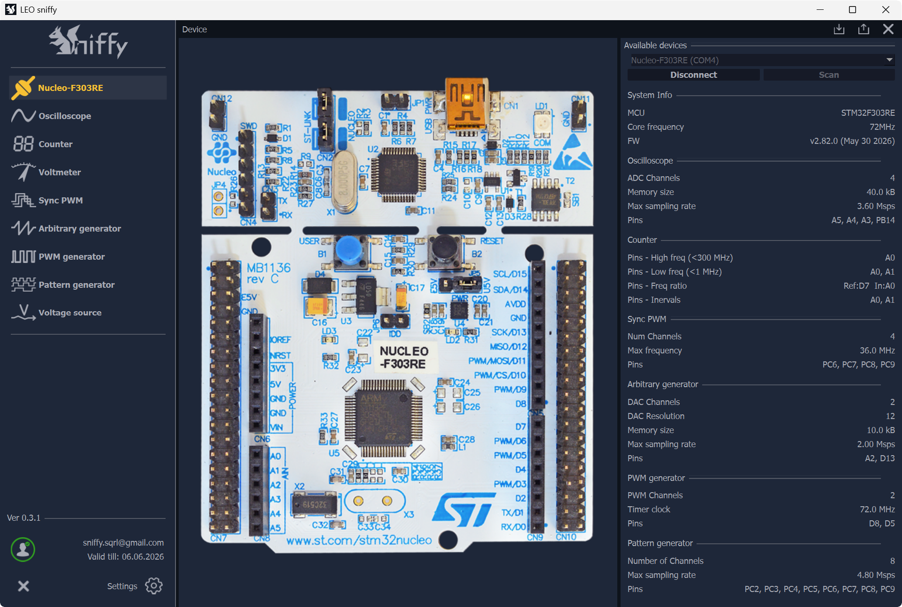

## 4. Orientation in the main window

The main window is divided into two main areas.

### Left panel

- contains buttons for individual modules,
- can be toggled between wide and narrow mode,
- displays the application version at the bottom,
- contains the login status,
- contains a footer with buttons to narrow the menu and open settings.

### Right workspace

- displays individual modules in dock widgets,
- upon opening a module, its specific UI is displayed in it,
- the layout can be moved and saved into a session,
- popup messages may appear here upon changes or errors.

### Important UI behavior

- modules are not loaded hardcoded, but according to the device's capabilities,
- some modules may be blocked due to pin conflicts,
- after flashing firmware or changing the login, the application may reopen the device automatically,
- after changing a theme, a notification may appear suggesting that restarting the application is advisable.

### List of modules and their states

Every Sniffy firmware offers several functions similar to standard laboratory instruments. In the application, these functions are represented as modules. The list of available modules is displayed after a successful connection and may vary depending on the board, MCU, and uploaded firmware.

By clicking an item in the left list, you open the module or toggle its state. Typically, you may encounter these states:

- OFF (empty - without an icon): the module is stopped and inactive; click to open and start it.
- ON {.manual-icon-inline}: the module is active, running, and its window is displayed.
- ON HIDN {.manual-icon-inline}: the module is active and running, but its window is hidden.
- IDLE {.manual-icon-inline}: the module is active, but currently not executing anything.
- IDLE HIDN {.manual-icon-inline}: the module is active, but currently not executing anything and its window is hidden.
- LOCK {.manual-icon-inline}: the module cannot be opened because the required resources are used by another module.
- PEND (animated circle): waiting for an event: the module is waiting for the completion or confirmation of some action.

The LOCK state typically applies to shared resources, such as timers, ADCs, or shared memory.

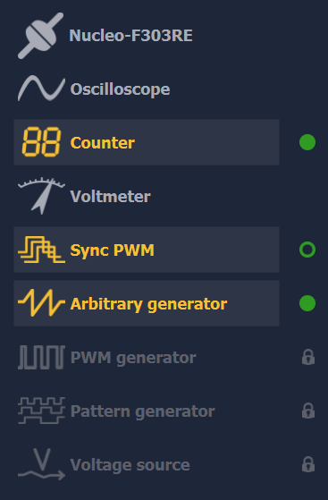{.manual-image--panel .manual-scale--85}

### Module windows

Each module opens in a new dockable window. You can adjust the layout inside the main window, or undock individual modules as separate windows. Docking and undocking work identically to standard desktop applications in Windows, including control via the top right part of the window header.

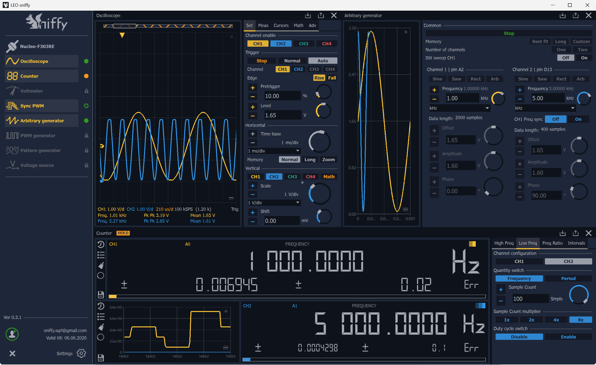

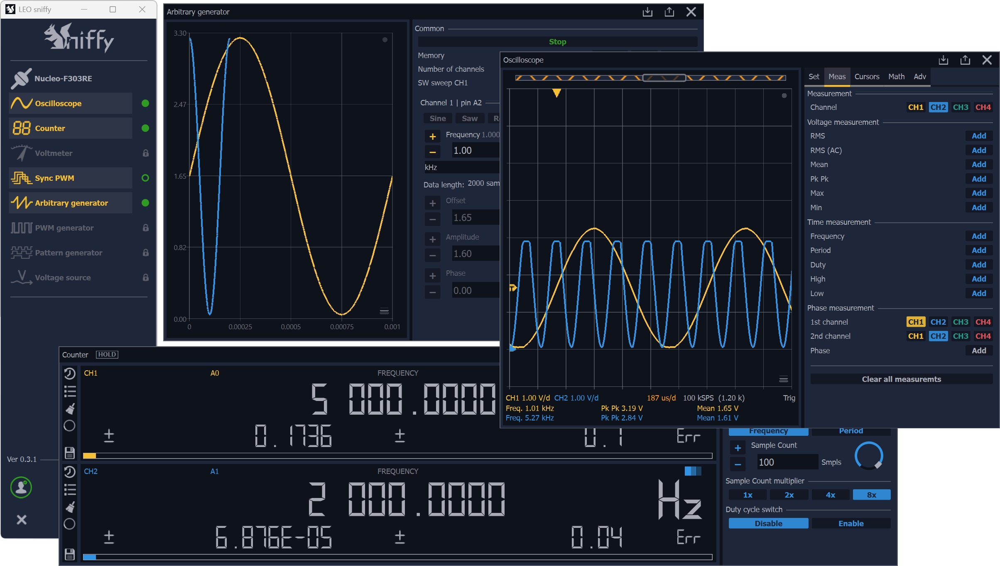

### Controls and value input

The GUI uses a small set of unified controls that repeat across modules. Buttons, tabs, and standard switches are intentionally designed simply, so it is mainly the more specific input elements that are worth describing.

<div class="manual-image-stack">
  <table class="manual-image-grid">
    <tr>
      <td>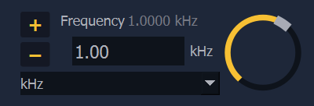</td>
      <td>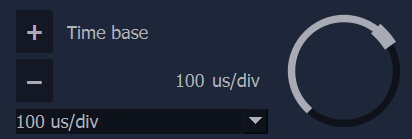</td>
    </tr>
  </table>
</div>

#### Text or numeric input

In some fields, you can type text or numbers directly. Decimal values accept both the local separator and the period/dot, so Czech and English inputs work identically. Numbers can also be written with abbreviated multiplier units, for example, 9.9k, 9k9, and 9900 can represent the same valid value.

{.manual-scale--60}

#### Rotary knob input

The rotary knob input is one of the most used controls in Sniffy. There are two basic variants: one works with fixed options, and the other allows setting an arbitrary numeric value.

- buttons: increase or decrease the value,
- selection: switches the base unit or chooses a value from predefined options,
- text value: for a numeric dial, it can be overwritten directly,
- dial: it can be controlled by the mouse wheel for fast, fine changes or by dragging the mouse for larger leaps.

When dragging the mouse, the change in value depends on the direction and distance from the diagonal axis, making it a fast way to get to the rough range and then fine-tune the value.

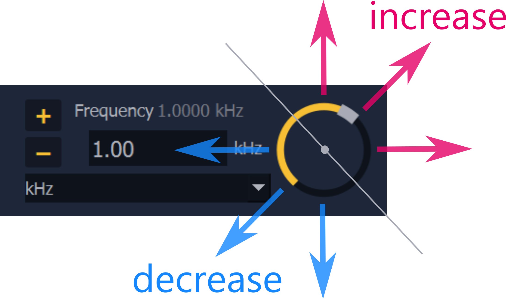{.manual-scale--50}

#### Common graph controls

Some modules use a common interactive graph, so the same minor controls repeat in, for example, the Oscilloscope, FFT view, Sync PWM, or in the generators.

- in the top right corner of the graph is a small circle for adjusting the grid prominence; with each click, the grid opacity increases by another step, and after reaching 100%, the next click returns it to 0%, so the grid can be completely hidden or, conversely, displayed as prominently as possible,
- in the bottom right corner of the graph is the data curve thickness control; clicking it cyclically switches between three data series widths: narrow, medium, and wide.

## 5. Device connection

### Connection procedure

1. Connect the board via USB.
2. Open the Device module.
3. Press Scan if the board does not appear automatically.
4. Select the found device from the list.
5. Press Connect.

### What the application does after connection

- opens communication with the board,
- resets the device to a known state,
- sends the user identity and token to the device if the user is logged in,
- waits for token confirmation or demo mode,
- loads the device configuration and prepared modules,
- optionally offers to restore the last session for the given board.

### Demo mode

If the firmware returns confirmation in demo mode, the application displays a "Running in demo mode" message. This is important mainly in situations where:

- the device does not have a valid license verification,
- the token was not accepted,
- some functions are meant to be restricted or inactive.

### Device module

The Device module is the first and key module. It displays:

- a list of available devices,
- Connect and Scan buttons,
- information about the device, firmware, and protocol,
- pin mapping for active modules,
- graphics of the board and its pinout.

### Switching between board image and pinout

In the Device module, you can switch from the standard view to the pinout by right-clicking the board image. The same right-click in the pinout returns you to the board image. If the application has a vector pinout available, it displays it directly with the active pin functions according to the enabled modules.

In the vector pinout, the view can be zoomed in or out with the mouse wheel. Holding the left mouse button and dragging pans the pinout. A double-click restores the default zoomed-out view, in which the pinout is adapted to the panel size.

This is practical mainly when verifying conflicts between modules and when wiring probes, generators, or digital lines.

### How to tell that the device is truly ready to work

Under normal conditions, the device is considered ready to work when:

- in the Device module, you see the specific board name instead of an empty or scanning state,
- the module list matches the connected hardware,
- Device displays specifications and the pinout instead of the default image without a device,
- the application does not repeatedly throw error messages after connection,
- for protected workflows, you have a valid login, or you are at least consciously working in demo mode.

### How to read pin names in the application

The pin names you see in the Device module and in the descriptions of individual modules are not hardcoded from the manual text, but come from the device configuration and specification.

In practice, this means:

- the same module can have different pins on different boards,
- the number of channels can vary by board,
- a pin marked with a dash or a missing item usually means that the given output or input is not available for the current combination,
- the safest approach is always to follow what the current pinout in the Device module shows, not an older screenshot from a different board.

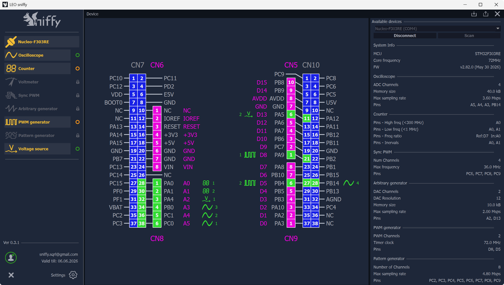

## 6. Login and licenses

Login is handled by a separate login dialog and server authentication on sniffylab.com. The desktop application does not work directly with a password; instead, it opens the login in a browser.

### How the login works from the user's perspective

1. Click on the login status at the bottom left.
2. Enter your email.
3. Click Check Login.
4. If you are not yet verified, the application opens the default browser and redirects you to the login on sniffylab.com.
5. After successful login, the application automatically continuously checks the status and saves the token.

### What the dialog displays

- text field for email,
- link for registration on sniffylab.com,
- status message,
- Check Login button,
- Close button,
- upon a valid login, also a Logout button.

### Token validity

- the token is issued for 1 week,
- the application stores its validity locally,
- upon expiration or with an invalid session, a firmware update or other protected action will require a new login.

### When the login is important

- when downloading compatible firmware from the server,
- when restoring sessions linked to a licensed device,
- during the handshake between the application and firmware, if the device requires verification.

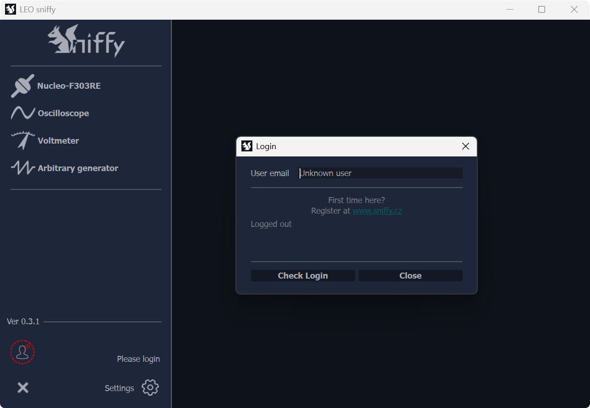{.manual-scale--80}

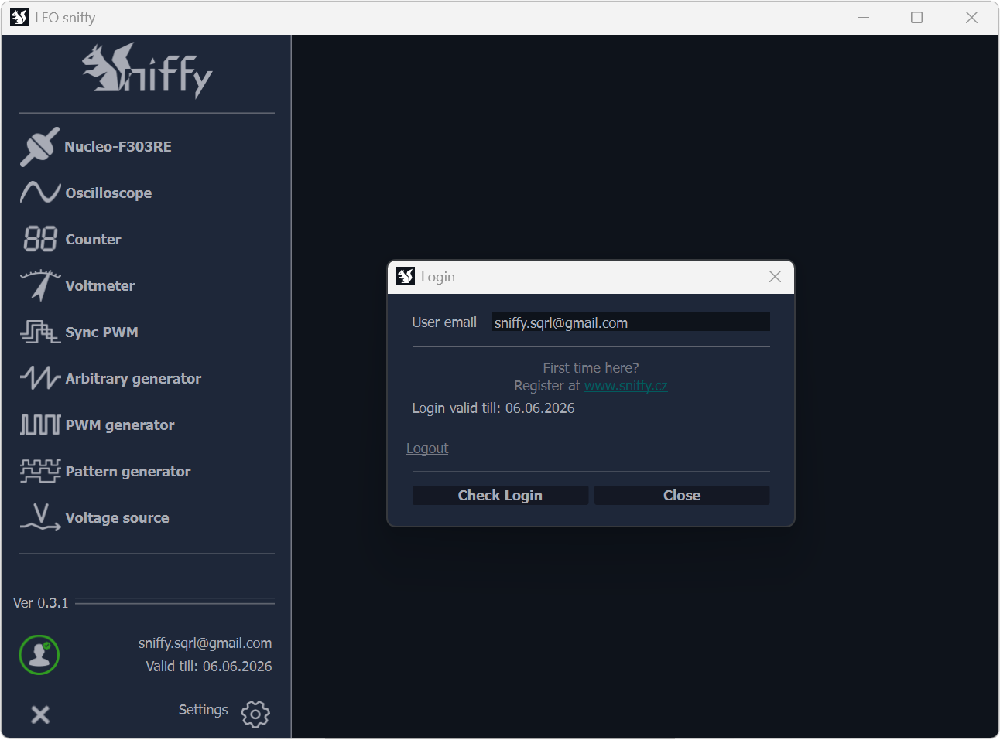{.manual-scale--80}

## 7. Application settings

The settings dialog has four tabs: General, Appearance, Firmware, and About.

### 7.1 General

In the General section, you will find session management.

#### Restore session after startup

There are three options:

- No: the session does not restore automatically after connection,
- Always ask: the application will ask whether to restore the last session for the specific device,
- Yes: the session is restored automatically.

#### Smart session layout and geometry

Options:

- Off: upon loading the session, the saved position and dimensions of the window are also restored,
- On: the application will attempt to keep the current window location and use only the appropriate size and layout.

#### Session

Buttons:

- Save: saves the current session into a JSON file,
- Load: loads a previously saved JSON session.

### 7.2 Appearance

The Appearance section allows selecting the application theme. In the current code, the following themes are prepared:

- Dark,
- Light,
- Dawn,
- Greenfield,
- MS-DOS,
- Ember.

After changing the theme, the application may warn that a restart is advisable for the new look to take effect consistently.

### 7.3 Firmware

The Firmware section contains:

- Install / Flash button,
- progress bar,
- operation progress log,
- Mass Erase button.

The choice of the firmware source is present in the internal implementation, but is hidden in the current UI. From the user's perspective, the firmware update works as a single intelligent action: the application itself decides whether to use a compatible local cache or download new firmware.

### 7.4 About

The About section contains:

- application version,
- link to the overview of open-source notices,
- Third-party licenses button.

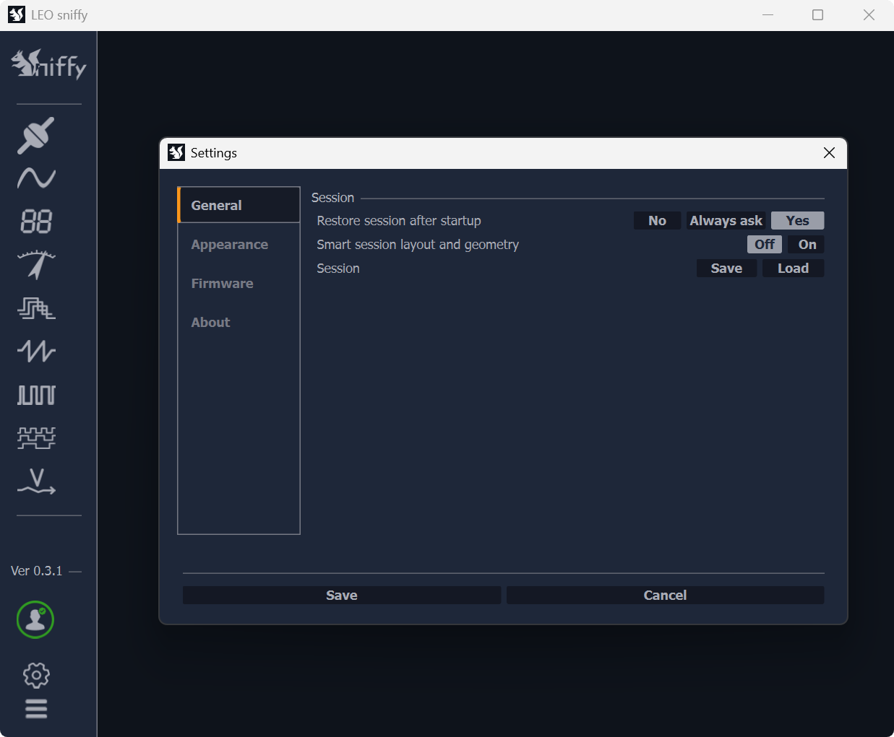{.manual-scale--80}

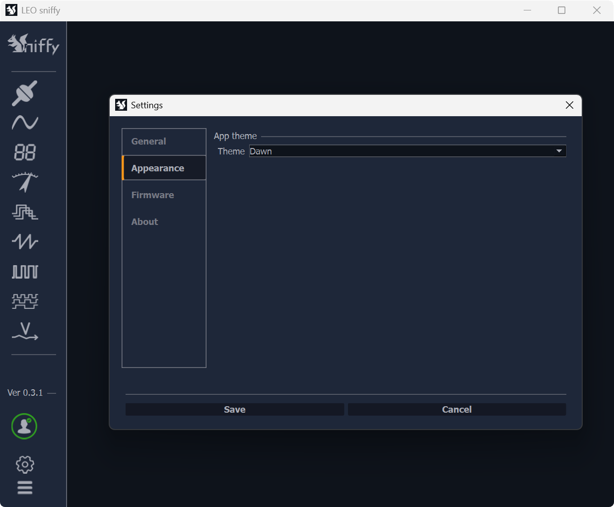{.manual-scale--80}

## 8. Firmware update

The firmware update is designed to be as simple as possible for the user, yet secure against incompatible versions.

### Typical workflow

1. Log in.
2. Open Settings.
3. Go to Firmware.
4. Click Install / Flash.
5. Monitor the progress bar and log.
6. After completion, let the application reopen the device or reconnect the board manually.

### What the application checks in the background

- connection to ST-Link,
- MCU UID and MCU type,
- availability of the latest firmware manifest,
- firmware compatibility with the desktop application version,
- protocol compatibility,
- user login validity,
- availability of a locally cached compatible binary.

### Important features

- firmware is cached per MCU UID,
- the binary is tied to the specific MCU UID,
- a compatible local cache can be used instead of a new download,
- incompatible or missing firmware metadata is rejected by the application,
- if the user is not logged in, the firmware update ends with a prompt to log in.

### Mass Erase

Mass Erase:

- erases the firmware from the device,
- uses ST-Link outside the normal communication path,
- after completion, disconnects the device from the regular application,
- should be used only when you truly need a clean state.

> Warning: Mass Erase is a destructive operation. After its completion, the Sniffy firmware will not be functional on the board until you flash it again.

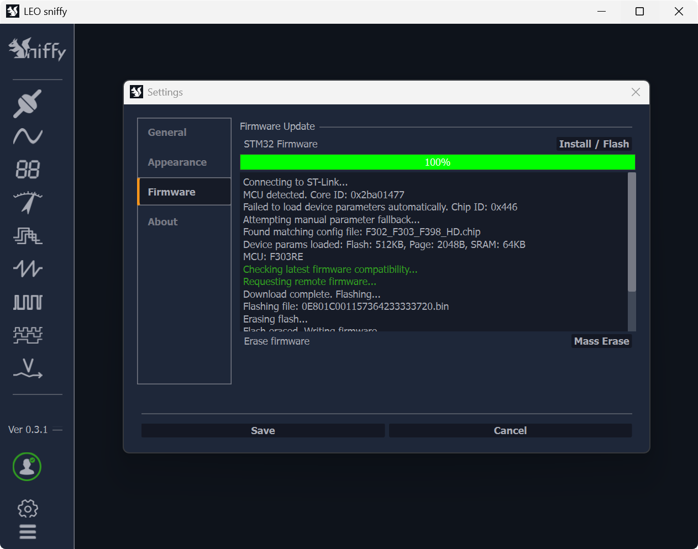{.manual-scale--80}

## 9. Modules overview

| Module | Purpose | Typical Use |
| --- | --- | --- |
| Device | board and pinout information | device selection, pin checking |
| Oscilloscope | analog signal acquisition | waveform measurement, trigger, FFT |
| Counter | precise frequency and time measurement | HF, LF, ratio, intervals |
| Voltmeter | voltage measurement | monitoring DC/AC values, logging |
| Sync PWM | synchronous PWM outputs | motor control, time-bound PWM |
| Arb. generator | analog waveforms | sine, sawtooth, square, custom data |
| PWM generator | PWM generation via generator variant | PWM with supplementary parameters |
| Pattern gen. | digital patterns and protocols | UART, SPI, I2C, coding |
| Voltage source | DC voltage outputs | reference, bias, testing |

### Not every board offers the same modules and limits

The module overview above is intentionally general. In practice, differences between boards mainly include:

- the number of available channels,
- the specific pins assigned to individual functions,
- the maximum frequency,
- the memory size for acquisition or generation,
- the availability of special modes.

Therefore, it is always a good idea to open the Device module before starting work on a new board and check:

- the number of channels,
- the pin list,
- maximum values,
- any restrictions or conflicts between modules.

## 10. Oscilloscope module

The Oscilloscope is the richest module in the application. It is divided into five tabs: Set, Meas, Cursors, Math, and Adv.

### 10.1 Set tab

In the Set tab you configure:

- time base,
- pretrigger,
- active channels CH1 to CH4,
- trigger mode: Auto, Normal, Single, Stop,
- trigger edge: rising or falling,
- trigger channel,
- trigger level,
- memory policy,
- vertical scale and offset for the selected channel,
- math channel operations.

### 10.2 Meas tab

The Meas tab adds measurements over data. At least these variables are available:

- RMS,
- RMS-AC,
- Mean,
- Min,
- Max,
- Peak-to-peak,
- Frequency,
- Period,
- Duty,
- High,
- Low,
- Phase,
- Clear all.

### 10.3 Cursors tab

Allows working with cursors in the time and amplitude domains. The following are available:

- horizontal cursors A and B,
- vertical cursors A and B,
- cursors for the FFT view as well,
- selection of the cursor type and assigned channel.

### 10.4 Math tab

Math allows two types of work:

- symbolic calculation over channels,
- FFT.

In the FFT part you can configure:

- input channel,
- window type,
- display method,
- FFT length,
- vertical scaling.

### 10.5 Adv tab

In the Advanced section, you can configure:

- resolution,
- custom sampling frequency,
- custom data length,
- working mode including XY display,
- selection of X and Y axes in XY mode.

### Typical workflow

1. Open Oscilloscope.
2. Turn on the desired channels.
3. Set the time base and trigger.
4. Monitor the waveform on the graph.
5. Add measurements or FFT as needed.

### What to watch out for

- not all combinations of channels and memory lengths are suitable for FFT,
- an erroneous mathematical expression leads to an invalid math trace,
- XY mode only makes sense with two valid channels,
- acquisition range and speed depend on the hardware.

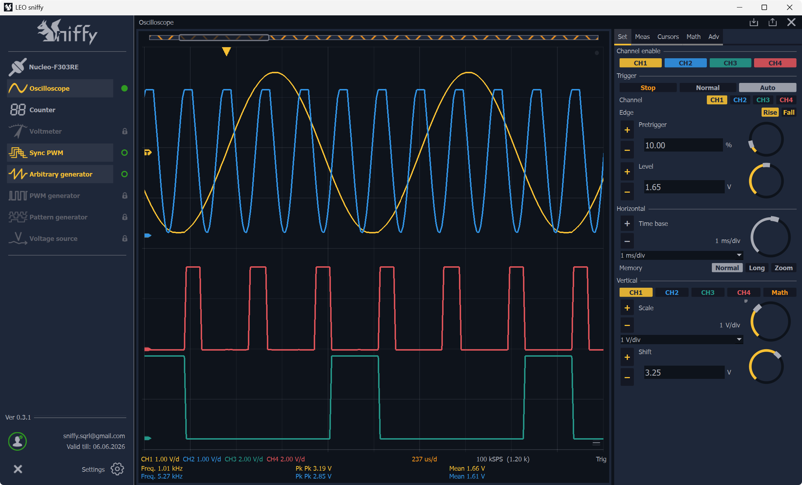

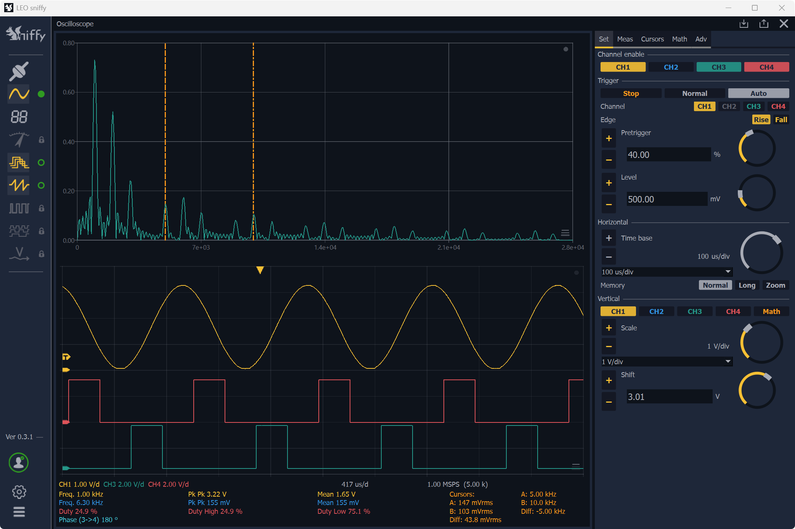

## 11. Counter module

The Counter is divided into four measurement modes: HF, LF, Ratio, and Intervals.

### HF

Use for high-frequency measurements. You typically configure:

- the measured variable Frequency or Period,
- averaging or error display behavior,
- gate time.

### LF

Use for slower signals. Usually available:

- channel selection,
- Frequency or Period,
- number of samples,
- multiplier selection,
- duty cycle display.

### Ratio

Suitable for the ratio of two frequencies or related inputs. The number of samples and the stability of the reference input are primarily important.

### Intervals

Use for measuring the time between two events. You configure:

- the order of events,
- edges A and B,
- timeout.

### Typical workflow

1. Open Counter.
2. Select the mode.
3. Configure the channel or measurement parameters.
4. Start the measurement.
5. Monitor the main value and the history.

### Notes

- available maximums depend on the board,
- interval measurement has a timeout up to hour values,
- poor signal quality or an unsuitable input can result in unstable readings.

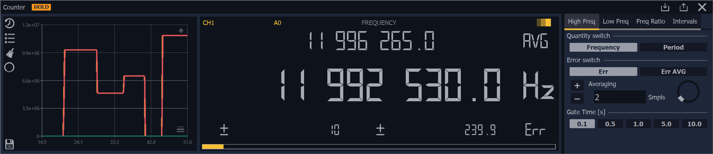{.manual-scale--95}

## 12. Voltmeter module

The Voltmeter is built on the same acquisition base as the oscilloscope and therefore shares resources with it. The ADC sampling frequency is 5 ksps, the data length is 200 samples, and the channel sampling time is fixed at 40 ms. The displayed value corresponds to the average of the measured signal.

- It is possible to display the min/max measured values or the voltage ripple and its frequency.
- Vdd is sampled once every N samples to allow continuous calibration of the measurement.
- With a higher number of samples for averaging, Vdd is sampled over a longer period and the resulting accuracy is usually better.
- Vdd sampling can be skipped by turning on the Fast mode.

The Voltmeter has two tabs: Control and Data log.

### Control

In the Control section you can:

- turn individual channels on or off,
- toggle Speed between Normal and Fast,
- set averaging from 1 to 64 samples,
- select the display method for supplementary data: Min/Max, Ripple, or None,
- monitor current Vcc,
- monitor continuous progress.

### Data log

In the Data log section you can:

- select the file for recording,
- see the path to the selected file,
- start and stop logging.

Recording runs into a standard CSV file. The datalog contains the date and time the sample was taken, the corresponding Vdd, and the measured values of the individual channels.

### What is saved

The log contains at least the following on each line:

- sample index,
- date,
- time with milliseconds,
- current Vdd,
- individual channel values.

### Typical workflow

1. Open Voltmeter.
2. Turn on the necessary channels.
3. Set the averaging and display mode.
4. To log, go to Data log.
5. Select a file and press Start.

### Notes

- you cannot start logging without a selected file,
- the file is overwritten upon a new log start,
- measurement quality depends on the stability of the reference and the wiring.

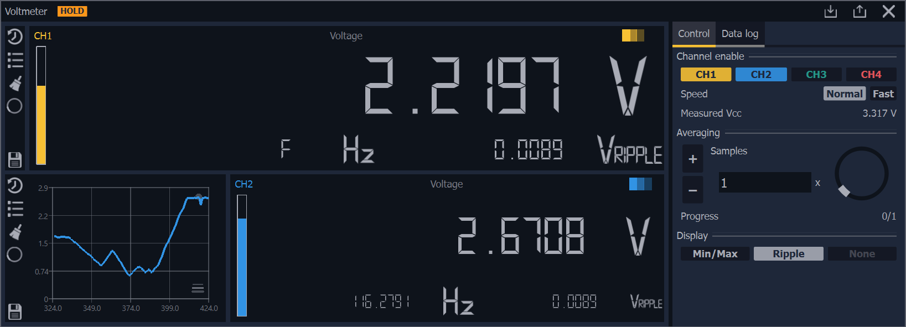{.manual-scale--80}

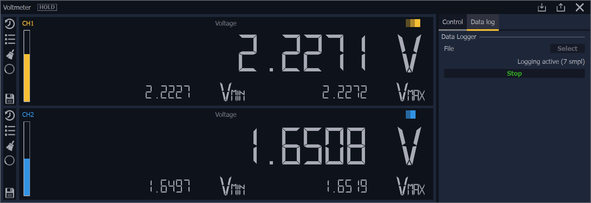{.manual-scale--80}

<div class="manual-table-half" markdown="1">

| sample ID | date | time | Vdd | Voltage CH1 | Voltage CH2 | Voltage CH3 | Voltage CH4 |
| --------- | ---------- | ------------ | ----- | ----------- | ----------- | ----------- | ----------- |
| 0 | 01.04.2021 | 11:39:59.611 | 3.323 | 0.0682914 | 0.0686606 | 0.209109 | 1.4729 |
| 1 | 01.04.2021 | 11:40:00.736 | 3.323 | 0.0718227 | 0.0728447 | 0.222619 | 1.57114 |
| 2 | 01.04.2021 | 11:40:01.541 | 3.323 | 0.0695935 | 0.06956 | 0.221218 | 1.57103 |
| 3 | 01.04.2021 | 11:40:01.874 | 3.324 | 0.0687527 | 0.0712899 | 0.223016 | 1.57208 |

<div class="manual-caption">Example of the output CSV datalog from the Voltmeter module</div>
</div>

## 13. Sync PWM module

Sync PWM is used for synchronous PWM outputs on multiple channels.

### Main functions

- frequency for individual channels,
- duty cycle,
- phase,
- toggling channels on and off,
- waveform preview in the graph,
- equidistant phase distribution,
- depending on the hardware variant, also inverting or dependent channels.

### When it comes in handy

- synchronous multi-channel PWM,
- time-bound control signals,
- experiments with phase shift.

### What to watch out for

- some boards may have linked or shared channels,
- for dependent channels, not all controls may be active,
- the actual frequency range and precision are determined by the hardware.

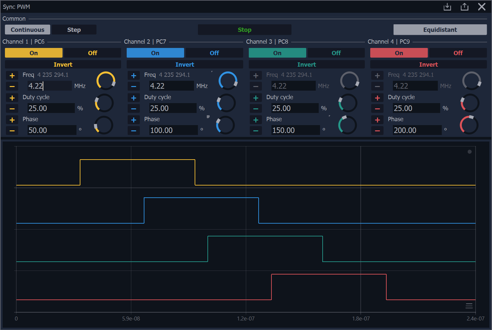{.manual-scale--85}

## 14. Arb. generator and PWM generator modules

There are two related generator variants in the application.

### Arb. generator

Used for analog or custom waveforms.

#### Generation principle

The generator uses timers, DMA, and a DAC to generate the analog signal directly via hardware. The signal is represented in memory as an array of samples, and with each timer overflow, the next sample is sent to the DAC.

- This approach requires practically zero MCU processor time.
- DDS is not used here because it would consume CPU time.
- DACs in MCUs have limited capabilities in terms of maximum generation speed and output current.
- When the signal approaches the supply voltage or GND, it can be distorted because the DAC output buffer cannot go completely to the range edges.

#### Main functions

- waveform shape: sine, sawtooth, square, arbitrary from a data file,
- frequency,
- amplitude,
- offset,
- phase,
- duty cycle for square waves,
- number of active channels,
- memory modes: Best fit, Long, Custom,
- software sweep,
- channel synchronization against CH1,
- loading a custom waveform file,
- progress during generation.

#### Signal graph

The graph shows how the waveforms will look when generated through the DAC. By default, one signal period is displayed, which is primarily useful for comparing shape, offset, and amplitude.

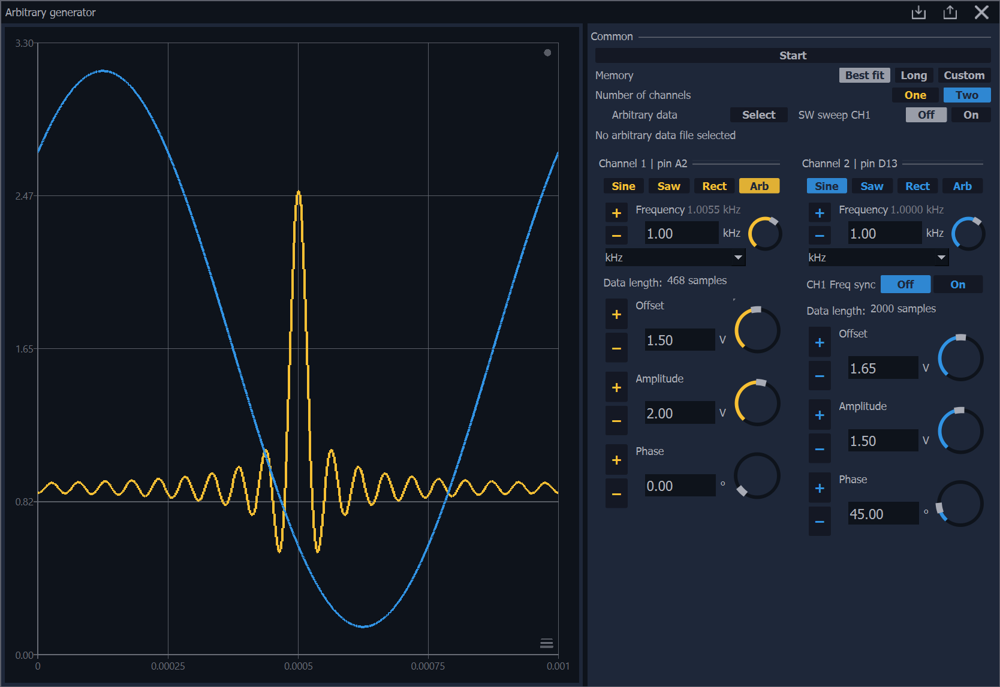{.manual-scale--85}

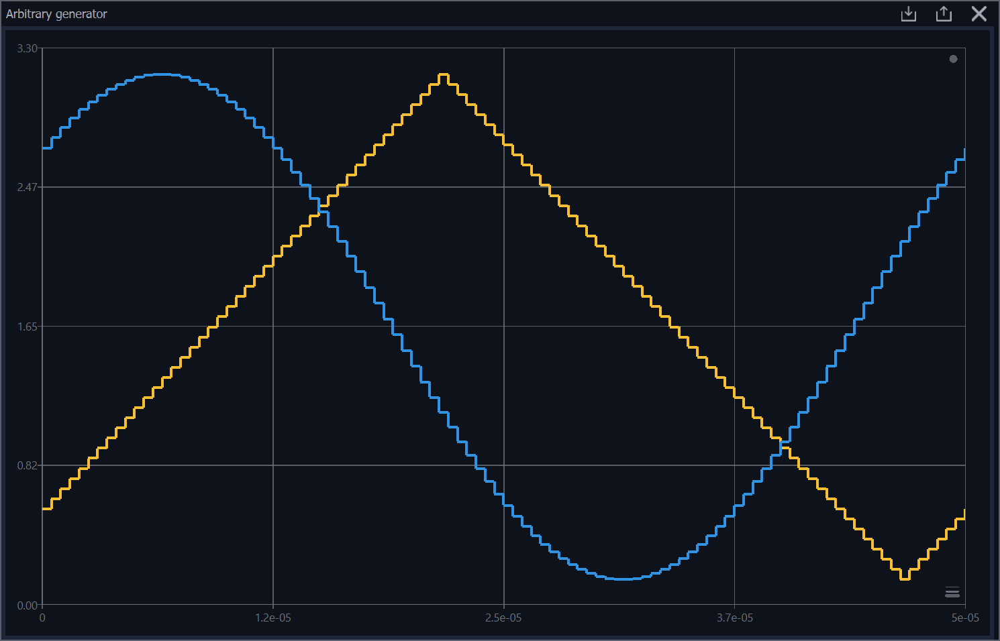{.manual-scale--85}

#### Memory length

Due to the generation principle, the frequency cannot always be set perfectly accurately at full memory length because the MCU clock signal is divided by an integer. A more precise frequency can often be achieved precisely by adjusting the memory length.

The available modes are:

- Best Fit: the buffer length is adjusted so that the frequency error is as small as possible; the minimum length is usually limited to roughly a quarter of the maximum buffer,
- Long: the longest possible memory length for the given frequency is used,
- Custom: the user manually specifies the number of samples to generate.

#### Changing frequency on the fly

The output frequency can be changed even during generation. In this case, the memory length is locked and mainly the sampling frequency is altered. Therefore, changing the frequency is practical, but not always entirely precise.

The maximum frequency is limited by the maximum DAC sampling frequency and the memory length:

$$
f_{max} = \frac{f_{s,DAC}}{n}
$$

For example, with a maximum DAC sampling frequency of 2 MSPS and a memory length of 1000 samples, the maximum frequency of the output signal is approximately 2 kHz.

#### Frequency and phase synchronization

If you use multiple channels, the generator supports frequency synchronization with the CH1 channel. Depending on the GUI settings, phase can be synchronized simultaneously.

When changing frequency or during a sweep, it can happen (especially at higher frequencies) that the phase synchronization drifts slightly. If this occurs, it usually helps to turn the synchronization for the given channel off and back on.

#### Frequency sweep

Sweep is implemented via software, and the generation frequency is updated approximately every 50 ms. It primarily affects the CH1 channel, and other channels can join in through frequency synchronization.

Sweep parameters can be changed on the fly, but the limitations based on the maximum DAC frequency and the chosen memory length still apply.

#### Input from a custom file

When the Arbitrary type is selected, the GUI can load CSV or TXT files, and the parser attempts to recognize standard format variants automatically.

It recognizes mainly:

- the first row as data or as a header,
- value separators, for example, a comma or a semicolon,
- decimal comma as well as decimal dot,
- multiple channels with different lengths,
- data expressed in voltage or as raw DAC values,
- a time axis in the first column if the values are equidistant.

Below are four practical variants that correspond to the examples in the attached screenshots and the current implementation of the loader.

#### Example 1: time axis + one channel

<div class="manual-table-half" markdown="1">

| time | data |
| --- | --- |
| 0.01 | 0.2 |
| 0.02 | 0.5 |
| 0.03 | 1 |
| 0.04 | 1.5 |

</div>

This format is suitable for a single analog channel. If the first column is equidistant, the application derives the sample rate from it and does not count it as a channel in the data itself.

#### Example 2: time axis + two channels

<div class="manual-table-half" markdown="1">

| time | data | data2 |
| --- | --- | --- |
| 0,01 | 0,2 | 2 |
| 0,02 | 0,5 | 3 |
| 0.03 | 1 | 1 |
| 0.04 | 1.5 |  |
| 0.05 | 1.9 |  |

</div>

Two important properties of the parser are visible here: it handles the combination of a decimal comma and a dot, and it supports multiple channels in a single file. In practice, individual channels can even have different lengths.

#### Example 3: one column of raw DAC values

<div class="manual-table-half" markdown="1">

| DAC |
| --- |
| 512 |
| 1024 |
| 2048 |
| 1536 |
| 1024 |

</div>

If the values significantly exceed the normal voltage range, the loader interprets them as raw DAC codes and recalculates them according to the selected resolution and output range.

#### Example 4: one column of voltage values

<div class="manual-table-half" markdown="1">

| data |
| --- |
| 0,1 |
| 0.8 |
| 1.03 |
| 0.04 |

</div>

The simplest variant for a single channel without a header and without a time axis. Again, both the decimal comma and the dot work, so it is well-suited for short, manually written waveform files.

### PWM generator

The PWM generator uses a related foundation but focuses on PWM generation. In practice, it can add or highlight parameters like PWM frequency and the synchronization of PWM parameters.

### Typical workflow

1. Open Arb. generator or PWM generator.
2. Choose the signal shape.
3. Set the frequency, amplitude, offset, and optionally the phase.
4. In arbitrary mode, load a custom file.
5. Start generation and monitor progress.

### Notes

- it may not be possible to change all parameters while generating is active,
- a custom waveform must respect the buffer capacity,
- sweep and synchronization are powerful, but depend on the specific hardware.

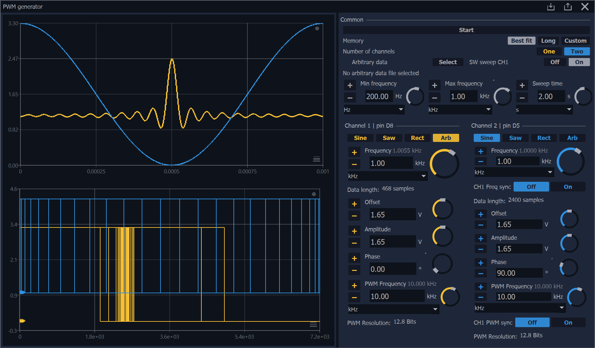

## 15. Pattern gen. module

Pattern gen. is intended for digital patterns and protocol scenarios. It is one of the most versatile modules because it combines common logical patterns as well as communication protocols.

### Main controls

- pattern selection,
- frequency,
- length or number of channels,
- pattern reset,
- generation and running progress,
- special settings based on the selected pattern.

### Available patterns

- User Defined,
- Counter Clock,
- Binary Code,
- Gray Code,
- Quadrature,
- PRBS,
- PWM,
- Line Code,
- 4B/5B,
- Johnson N-Phase,
- PDM,
- Parallel Bus,
- UART,
- SPI,
- I2C.

### Patterns and their typical parameters

#### User Defined

- manual editing of the pattern grid.

#### Quadrature

- selection of the sequence A->B or B->A,
- suitable for encoder scenarios.

#### PRBS

- choice of the order of the pseudo-random sequence.

#### Line Code

Supported types from the code include at least:

- NRZ-L,
- RZ,
- Manchester,
- Miller,
- BiPhaseMark,
- BiPhaseSpace.

#### UART

Typical choices:

- baud rate,
- number of data bits,
- parity,
- number of stop bits,
- bit order,
- idle level,
- framing error,
- break.

#### SPI

Typical choices:

- SPI mode,
- word size,
- bit order,
- CS gating,
- pause between transfers.

#### I2C

Typical choices:

- clock frequency,
- address mode 7bit or 10bit,
- address,
- read/write,
- ACK,
- clock stretching,
- repeated start.

Upon selecting an I2C pattern, the application inherently switches the respective pins to open-drain behavior according to the code, and reverts them back upon leaving the I2C pattern.

### What to watch out for

- more complex patterns can significantly change the effective output length,
- UART, SPI, and I2C protocols have their own timing limits,
- the available number of lines depends on the board and firmware.

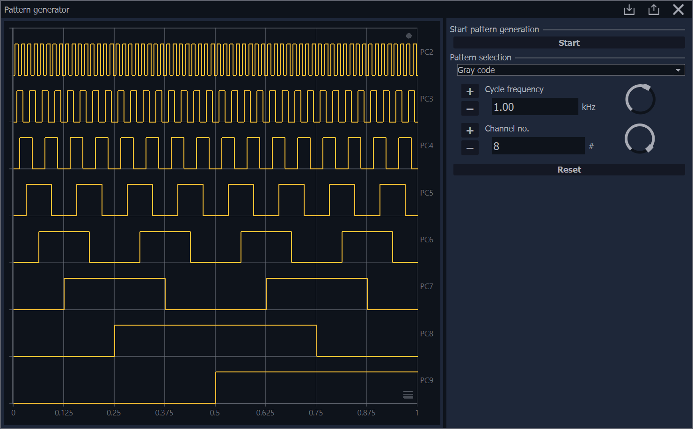

## 16. Voltage source module

The Voltage source is used to set analog DC levels on available channels.

### Main functions

- output voltage setting for each channel,
- toggling channels on,
- clear display of the value and relative level,
- display of the current Vcc reference.

### Typical use

- input biasing,
- simple reference source,
- testing the analog part of a circuit.

### Limitations

- voltage range is determined by the DAC and the board's power supply/reference,
- does not support negative voltage,
- the output is directly dependent on the physical load of the output.

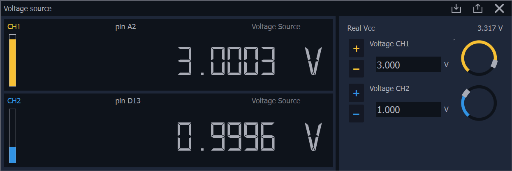{.manual-scale--80}

## 17. Module and pin conflicts

Sniffy tracks the active use of resources and pins. This has practical implications for the user:

- some modules cannot be used simultaneously,
- turning on one module can temporarily block another,
- the pinout in the Device module helps locate conflicts,
- pin mapping is updated when active modules change.

If a module is not behaving as expected, always check first:

- whether another module has already occupied the necessary pin,
- whether the module is genuinely active,
- whether the correct board and right firmware are connected.

> *NOTE: Hardware collisions with board equipment*
>
> *On Nucleo development boards, a user LED is often populated from the factory, firmly tied to a specific microcontroller pin. If an active module's function (for example, Arb. generator output) is mapped precisely to this pin, the soldered LED begins to act as a load. The resulting symptom is usually a noticeably clipped output voltage on the given channel and the fact that the LED on the board lights up or flickers. If you need to work with the full voltage range or without distortion on such a pin, it is necessary to carefully desolder the LED (or its series resistor or the corresponding solder bridge) from the board.*

## 18. Session and workspace layout

### What the session contains

The session saves:

- main window geometry,
- state of dock widgets,
- layout of individual modules,
- module configurations,
- module activation states,
- state of the left menu.

### Automatic saving

Upon finishing work with a connected device, the session is saved automatically under the device's name into the application's configuration folder.

### Manual saving and loading

In Settings -> General, the session can be manually:

- saved to a JSON file,
- loaded from a JSON file.

### Restore after connection

After connecting a device, the application can:

- restore nothing,
- ask,
- restore the session automatically.

This is governed by the Restore session after startup option.

### Where the application saves local files

Sniffy uses the standard application configuration directory of the operating system. It saves several critical files into it:

- `settings.ini`: basic application settings, for example, theme, session restore option, email, token, and its validity,
- `sessions/<device_name>.json`: automatically or manually saved sessions for a specific board,
- `<MCU_UID>.bin`: local cache of firmware downloaded for a specific device,
- `<MCU_UID>.manifest.json`: metadata for the corresponding cached binary.

From a user's perspective, it's good to know:

- sessions are stored per device, so two different boards can have different layouts and configurations,
- the firmware cache is tied to a specific MCU UID,
- transferring these files between different boards makes no sense,
- if you are troubleshooting a broken session or an odd old layout, it is usually quickest to check/delete precisely these local files.

### When it makes sense to delete or clear local files

Manual intervention in local files makes sense mostly in these situations:

- the session loads incorrectly after a major application version change,
- you want to start with a clean layout without old docks and positions,
- you are testing multiple firmware variants and do not want to use the old cache,
- you are switching to a different working configuration and want to remove old user traces.

> Recommendation: if you are deleting the session or firmware cache manually, always do it with the application closed.

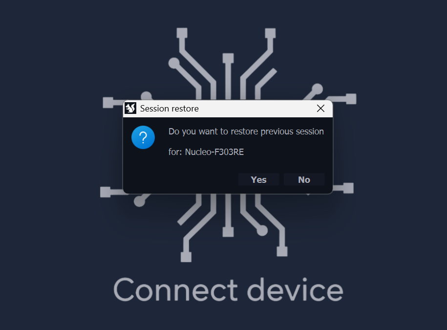

## 19. Troubleshooting typical problems

### The application does not see the board

Check:

- USB cable and power supply,
- ST-Link driver,
- udev rules on Linux,
- that the board is indeed running Sniffy firmware.

### The application reports demo mode

This means that the firmware did not confirm a full authenticated mode. Check the login, token, or the board's licensing status.

### Flash firmware fails

Check:

- that you are logged in,
- that the board matches the expected MCU,
- that you are using a Sniffy version compatible with the firmware,
- that another application is not holding the ST-Link.

### The session does not restore correctly

Check:

- the Restore session after startup setting,
- the Smart session layout and geometry option,
- that you truly have a saved session for the given board,
- whether it isn't a significantly older session incompatible with the new application version.

### A module is inactive or closes immediately

Usually, this is due to one of these causes:

- the firmware does not support the given module,
- the module conflicts with another active module,
- the device is in a restricted mode,
- an issue occurred in the handshake after connection.

## 20. Advanced use: Agent Bridge and sniffy-mcp

This chapter is intended for advanced users who want to control the application via scripts, an AI agent, or via MCP.

### What is Agent Bridge

Agent Bridge is a local IPC layer inside the desktop application. The application starts it automatically according to the code and makes functions accessible via a named pipe.

Features:

- runs locally, does not open a network port,
- uses JSON-RPC 2.0,
- changes made by the agent manifest in the standard GUI,
- can control the device, modules, and read data.

### sniffy-mcp

The project also includes the Python package sniffy-mcp, which serves as a client and MCP server.

#### Installation of the published version

```bash
pip install "sniffy-mcp[mcp] @ https://sniffylab.com/sniffy_mcp_latest.php?format=wheel"

```

```powershell
$meta = Invoke-RestMethod https://sniffylab.com/scripts/sniffy_mcp_latest.php?format=json
pip install "sniffy-mcp[mcp] @ $($meta.wheel_url)"

```

#### Local development installation

```bash
cd sniffy/tools/sniffy_mcp
pip install -e .
pip install -e ".[mcp]"

```

#### What can be controlled

- scanning and connecting a device,
- starting and stopping modules,
- oscilloscope configuration,
- reading scope data and measurements,
- Sync PWM control,
- Counter control,
- Arb/PWM generator control,
- Pattern gen.,
- Voltage source,
- Voltmeter and its datalogger.

#### When this is useful

- automated tests,
- AI-assisted measurement,
- repeatable configuration sequences,
- remotely controlled laboratory workflows on a single PC.

For a full overview of methods and CLI examples, use the included documentation:

- [agentbridge/README.md](../agentbridge/README.md)
- [tools/sniffy_mcp/README.md](../tools/sniffy_mcp/README.md)

## 21. Recommended first workflow

If you want to quickly test Sniffy without unnecessary wandering, use this procedure:

1. Connect the board and verify it is found in the Device module.
2. Display the pinout and check where to connect a probe or output.
3. Open Oscilloscope and verify basic signal acquisition.
4. Open Voltmeter and check the voltage on the same or another channel.
5. Save the session so that the same layout restores next time.
6. Only then start using firmware update, Pattern gen., or AI automation.

### Recommended working habits

- Before the first measurement on a new board, always open Device and check the pinout.
- Before flashing firmware, close other ST tools that might hold the ST-Link.

## 22. Summary

Sniffy is a multipurpose desktop environment that integrates STM32 Nucleo board configuration, measurement, signal generation, firmware management, and advanced automation.

For an ordinary user, four areas are the most important:

- reliably connecting the right board,
- understanding pins and module conflicts,
- using sessions and firmware updates safely,
- selecting the right module for the specific task.